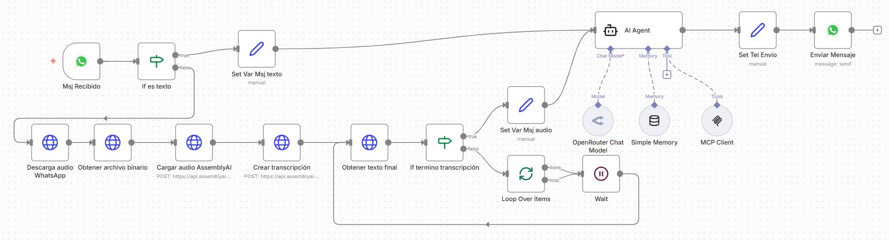
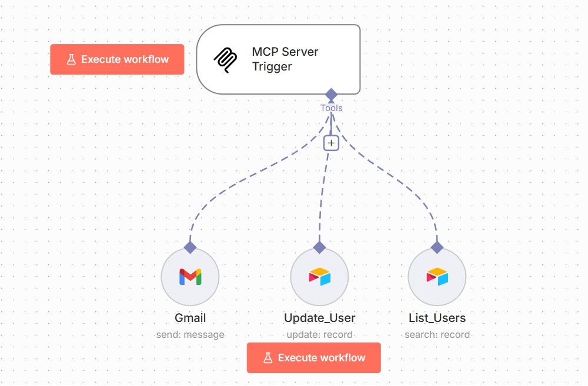
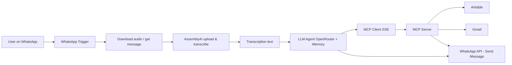

# 🤖 n8n AI Automation Projects

> Production-ready multi-agent automation systems built on n8n, integrating LLMs, WhatsApp, Jira, Google Drive and more through a custom MCP client/server architecture.

---

## 📁 Projects

- [Bot Skyner](#-bot-skyner) — WhatsApp AI assistant with voice transcription and LLM agent
- [Workers](#-workers) — Multi-agent supervisor system with Slack, Jira, Drive and database integrations

---

## 🔵 Bot Skyner

### Why I built this

I needed a WhatsApp-native AI assistant that could handle both text and voice messages, route them through an LLM agent with memory, and connect to business tools like Airtable and Gmail — all without a custom backend. Built entirely on n8n using a custom MCP client/server pattern for real-time communication.

### What it does

- Receives text and voice messages from WhatsApp
- Downloads audio and transcribes it via **AssemblyAI**
- Processes the transcript through an **LLM agent (OpenRouter)** with persistent memory via n8n LangChain nodes
- Connects to **Airtable** for data lookups and **Gmail** for notifications
- Sends responses back via WhatsApp API
- Uses a custom **MCP (client/server) over SSE** for real-time inter-workflow communication

### Screenshot

### Architecture

### Tech stack

| Layer | Technology |
|---|---|
| Workflow engine | n8n |
| Voice transcription | AssemblyAI |
| LLM / Agent | OpenRouter (via LangChain nodes) |
| Messaging | WhatsApp Business API |
| Data | Airtable |
| Notifications | Gmail OAuth |
| Real-time comms | MCP over SSE / webhooks |

### Files

| File | Description |
|---|---|
| `MCP Client Skynet.json` | Client workflow — WhatsApp trigger, transcription, LLM, response |
| `MCP Server Skynet.json` | Server workflow — Airtable, Gmail, MCP trigger |
| `secrets template.txt` | Variable name template for manual environment setup |

---
