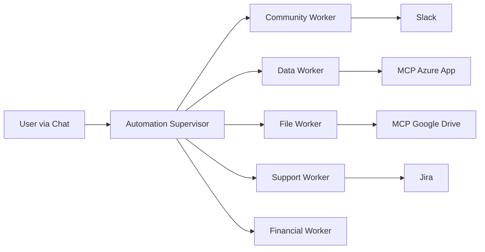

# Bot Skyner

Breve descripción
- Bot Skyner es un conjunto de flujos de trabajo de n8n que automatiza la recepción, transcripción y respuesta a mensajes de WhatsApp usando varios servicios externos y un pequeño "MCP" (cliente/servidor) para comunicación en tiempo real.

Qué hace
- Recibe mensajes/archivos de voz desde WhatsApp.
- Descarga y sube audios a AssemblyAI para transcripción.
- Procesa el texto usando un agente LLM (OpenRouter) y memoria (n8n LangChain nodes).
- Envía respuestas de vuelta por WhatsApp.
- Integra con Airtable y Gmail en el servidor para búsquedas y notificaciones.

Integraciones principales
- n8n (workflows): `MCP Client Skynet.json` y `MCP Server Skynet.json`.
- WhatsApp (API / trigger nodes).
- AssemblyAI (transcripción de audio).
- OpenRouter / LLM (chat/agent).
- Airtable (lectura/actualización de datos).
- Gmail (envío de correos via OAuth).
- MCP (SSE / webhooks) para mensajes en tiempo real.

Archivos importantes
- `MCP Client Skynet.json` — flujo del cliente (WhatsApp, transcripción, LLM, envío).
- `MCP Server Skynet.json` — flujo del servidor (Airtable, Gmail, trigger MCP).
- `secrets template.txt` — plantilla con nombres de variables (sin valores) para restauración manual.
 
English translation
-------------------

# Bot Skyner

Short description
- Bot Skyner is a set of n8n workflows that automates receiving, transcribing and replying to WhatsApp messages using external services and a small MCP (client/server) for real-time communication.

What it does
- Receives messages and voice files from WhatsApp.
- Downloads and uploads audio to AssemblyAI for transcription.
- Processes the text with an LLM agent (OpenRouter) and memory (n8n LangChain nodes).
- Sends responses back via WhatsApp.
- Integrates with Airtable and Gmail on the server side for lookups and notifications.

Main integrations
- n8n (workflows): `MCP Client Skynet.json` and `MCP Server Skynet.json`.
- WhatsApp (API / trigger nodes).
- AssemblyAI (audio transcription).
- OpenRouter / LLM (chat/agent).
- Airtable (read/update data).
- Gmail (send emails via OAuth).
- MCP (SSE / webhooks) for real-time messages.

Important files
- `MCP Client Skynet.json` — client workflow (WhatsApp, transcription, LLM, sending).
- `MCP Server Skynet.json` — server workflow (Airtable, Gmail, MCP trigger).
- `secrets template.txt` — template with variable names (no values) for manual restoration.

Diagram
-------

---

# Workers

Breve descripción
- Workers es un conjunto de flujos de trabajo de n8n que implementa una arquitectura multi-agente con un supervisor central que delega tareas a agentes especializados en comunicación, datos, archivos y soporte.

Qué hace
- Recibe instrucciones del usuario via chat y las delega al worker correspondiente.
- Envía mensajes por Slack (Community Worker).
- Ejecuta consultas en bases de datos vía MCP (Data Worker).
- Gestiona archivos en Google Drive vía MCP (File Worker).
- Crea y consulta tickets en Jira (Support Worker).
- Consulta información financiera de clientes (Financial Worker).

Integraciones principales
- n8n (workflows): `Automation Supervisor.json`, `Community Worker.json`, `Data Worker.json`, `File Worker.json`, `Support Worker.json`.
- Azure OpenAI (modelo LLM compartido por todos los workers).
- Slack (envío de mensajes a canales).
- Jira (gestión de tickets).
- MCP (SSE) para acceso a Azure App y Google Drive.

Archivos importantes
- `Automation Supervisor.json` — supervisor que recibe tareas y las distribuye entre workers.
- `Community Worker.json` — agente de Slack.
- `Data Worker.json` — agente de bases de datos vía MCP Azure App.
- `File Worker.json` — agente de archivos vía MCP Google Drive.
- `Support Worker.json` — agente de soporte con Jira.
- `secrets template.txt` — plantilla con nombres de variables (sin valores) para restauración manual.

English translation
-------------------

# Workers

Short description
- Workers is a set of n8n workflows implementing a multi-agent architecture with a central supervisor that delegates tasks to specialized agents for communication, data, files and support.

What it does
- Receives user instructions via chat and delegates them to the corresponding worker.
- Sends messages via Slack (Community Worker).
- Runs database queries via MCP (Data Worker).
- Manages files in Google Drive via MCP (File Worker).
- Creates and queries tickets in Jira (Support Worker).
- Queries financial client information (Financial Worker).

Main integrations
- n8n (workflows): `Automation Supervisor.json`, `Community Worker.json`, `Data Worker.json`, `File Worker.json`, `Support Worker.json`.
- Azure OpenAI (LLM model shared by all workers).
- Slack (sending messages to channels).
- Jira (ticket management).
- MCP (SSE) for access to Azure App and Google Drive.

Important files
- `Automation Supervisor.json` — supervisor that receives tasks and distributes them among workers.
- `Community Worker.json` — Slack agent.
- `Data Worker.json` — database agent via MCP Azure App.
- `File Worker.json` — file agent via MCP Google Drive.
- `Support Worker.json` — support agent with Jira.
- `secrets template.txt` — template with variable names (no values) for manual restoration.

Diagram
-------

